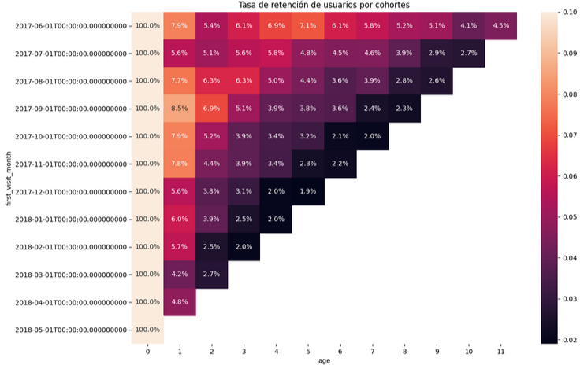

# Webpage business analysis
## Project background
This project focuses on analyzing data from the Y.Afisha webpage in order to provide insights for the marketing department to help them optimize the marketing cost budget. 

Insights and recommendations are provided on the following key areas:
- Product analysis: user activity assessment on a daily, weekly and monthly basis as well as average session lenght (ASL) and retention rate analysis
- Sales analysis: analysis of metrics like lead time and cohort analysis of life time value (LTV) and average revenue per user
- Marketing analysis: expense analysis (overall, per source and over time), analysis of CAC and ROMI metrics
  
## Executive summary

**Product analysis**

- Overall, user retention across all cohorts is quite low from the first month, with only 4% to 8% of users returning to the platform. Retention continues to decline over the following months, and by the end of the customer lifecycle, most cohorts have a retention rate of approximately 2%. This suggests a significant drop-off in user engagement over time, indicating potential issues with long-term user retention and the need for strategies to improve sustained engagement.
(mapa de calor)

- The distribution of visits over time is highly variable. There is a noticeable increase in daily, weekly, and monthly visits toward the end of 2017, with a peak of user activity on November, likely driven by seasonal trends. This pattern indicates that user engagement may be influenced by seasonal factors
(gráficos)

- User engagement on the webpage appears to be minimal, with an average session length (ASL) of just 1 minute and a visit frequency of 1.08 times per day. This suggests that users spend very little time interacting with the content and may not be deeply engaged.

**Sales analysis** 
- The October, November, and December 2017 cohorts had the highest cumulative order volume throughout their lifecycle, reaching between 5,894 and 6,005 orders by the final month. Similarly, the January, February, and March 2018 cohorts also demonstrated relatively strong and sustained performance. Notably, the first cohort (June 2017) showed a gradual increase in orders over time, accumulating 4,438 orders by the final month. In contrast, the July and August 2017 cohorts performed the worst, with fewer than 3,000 total orders over their lifecycle.

- On average, customers contribute between $3 to $6 in revenue during their first month. However, most cohorts do not continue making purchases in subsequent months, or the increase in revenue over time is minimal.  Additionally, the first cohort (June 2017) demonstrates a steady increase in contribution over time, accumulating an average of $11.8.

**Marketing analysis**

- Source
- The heatmap indicates that acquisition Source 3 had the highest spending, especially in the last three months, with monthly expenses ranging between $15,737 and $17,025. 
-   la fuente 5 es la que tiene menor tiempo de conversión promedio. A su vez, las fuentes 1 y 2 son las que generan más ingresos promedio por compra y no tienen un tiempo de conversión tan alto,
-   
-   el ROMI demuestra que ninguna de las fuentes de adquisición ha estado cerca de recuperar su inversión a excepción del primer mes,
