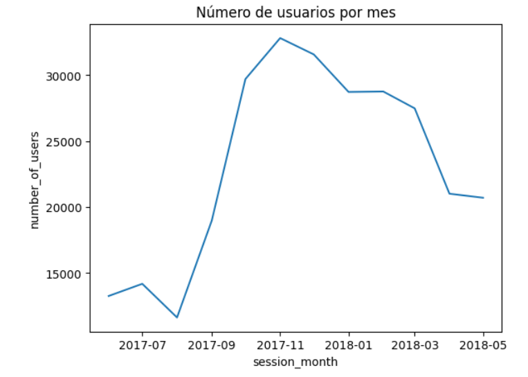

# Webpage business analysis
## Project background
This project focuses on analyzing data from the Y.Afisha webpage in order to provide insights for the marketing department to help them optimize the marketing cost budget. 

Insights and recommendations are provided on the following key areas:
- Product analysis: user activity assessment on a daily, weekly and monthly basis as well as average session length (ASL) and retention rate analysis
- Sales analysis: analysis of metrics like lead time and cohort analysis of life time value (LTV) and average revenue per user
- Marketing analysis: expense analysis (overall, per source and over time), analysis of CAC and ROMI metrics

## Used tools
- **Programming language**: Python
- **Development environment:** Jupyter Notebook
- **Libraries:** Pandas, Numpy, Matplotlib, Seaborn

## Executive summary

**Product analysis**

- Overall, user retention across all cohorts is quite low from the first month, with only 4% to 8% of users returning to the platform. Retention continues to decline over the following months, and by the end of the customer lifecycle, most cohorts have a retention rate of approximately 2%. This suggests a significant drop-off in user engagement over time, indicating potential issues with long-term user retention and the need for strategies to improve sustained engagement.

- The distribution of visits over time is highly variable. There is a noticeable increase in daily, weekly, and monthly visits towards the end of 2017, with a peak of user activity on November, likely driven by seasonal trends. This pattern indicates that user engagement may be influenced by seasonal factors

- User engagement on the webpage appears to be minimal, with an average session length (ASL) of just 1 minute and a visit frequency of 1.08 times per day. This suggests that users spend very little time interacting with the content and may not be deeply engaged.

**Sales analysis** 
- The October, November, and December 2017 cohorts had the highest cumulative order volume throughout their lifecycle, reaching between 5,894 and 6,005 orders by the final month. Similarly, the January, February, and March 2018 cohorts also demonstrated relatively strong and sustained performance. Notably, the first cohort (June 2017) showed a gradual increase in orders over time, accumulating 4,438 orders by the final month. In contrast, the July and August 2017 cohorts performed the worst, with less than 3,000 total orders over their lifecycle.

- On average, customers contribute between $3 to $6 in revenue during their first month. However, most cohorts do not continue making purchases in subsequent months, or the increase in revenue over time is minimal.  Additionally, the first cohort (June 2017) demonstrates a steady increase in contribution over time, accumulating an average of $11.8.

**Marketing analysis**

- The ad source that incurred the most cost was source 3. However, The Customer Acquisition Cost (CAC) for source 3 exceeds $13, indicating that this advertising source is proving to be less profitable. 

However, monthly CAC analysis also reveals that source 4 is also ineficient and had disproportionate costs in relation to the customers acquired. 

- The cumulative ROMI analysis over time reveals that sources 9 and 10 quickly recover their investment, even doubling it. In contrast, sources 2 and 3 are the least profitable, with cumulative returns of 0.77 and 0.69, respectively.

## Recommendations
1. It is recommended to stop investing on advertising source 3, as its high Customer Acquisition Cost (CAC) is not only failing to generate profits but is actually causing losses for the company. Redirecting the budget to more cost-effective channels could improve overall marketing efficiency and profitability.
   
2. It is recommended to prioritize the investment on advertising sources 9 and 10 as they generate more return of investment in a shor period of time and have a low acquisition cost.
   
3. It is recommended to implement changes to the website design or other measures that encourage users to spend more time exploring the services offered. This could help increase engagement and improve conversion rates.

4. The first cohort shows a sustained increase in both the number of orders and the revenue they generate throughout the entire customer lifecycle. Therefore, it is recommended to continue implementing loyalty strategies to retain and maximize the value of these customers.
